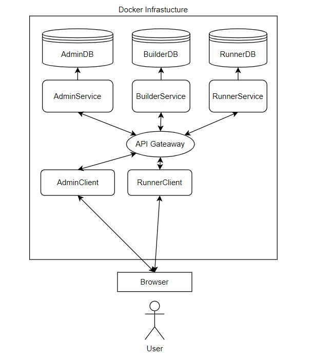
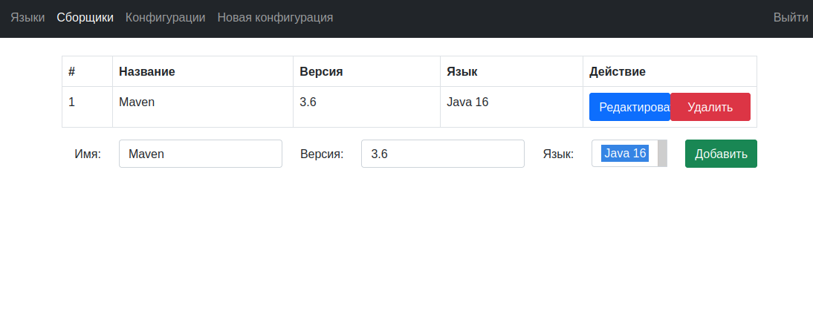
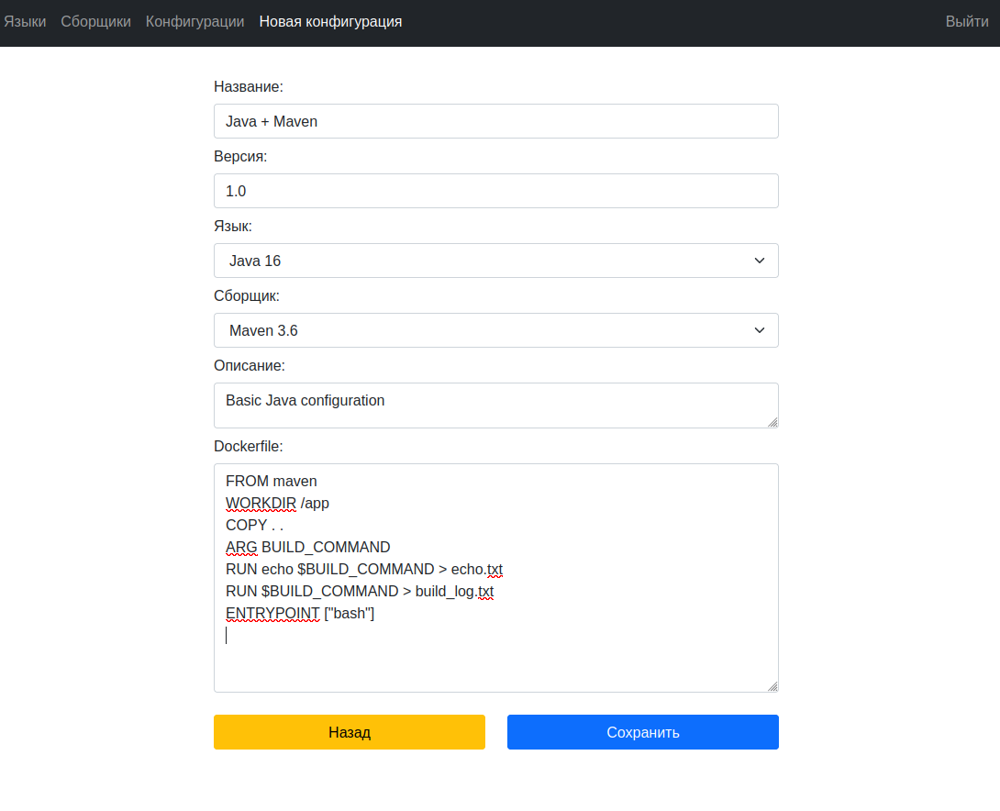
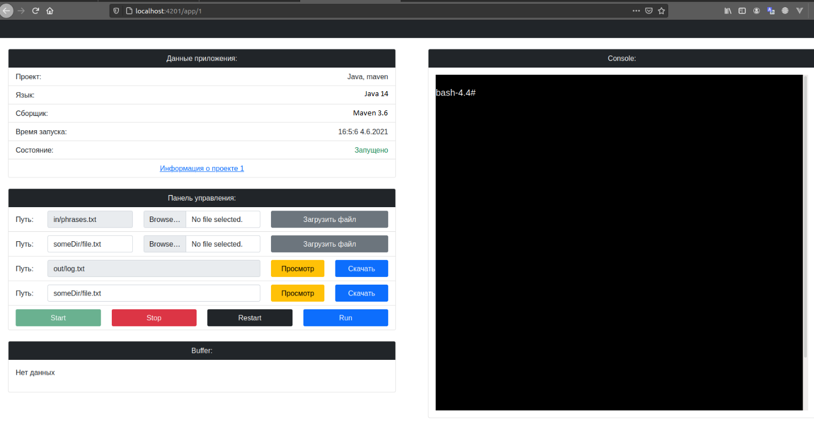
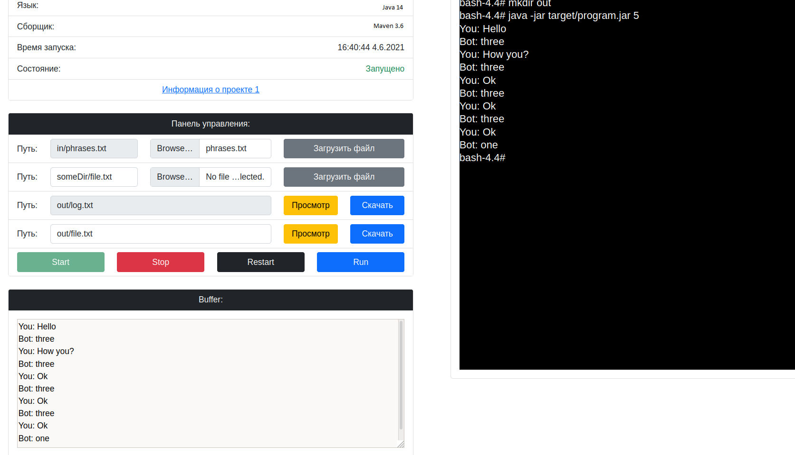
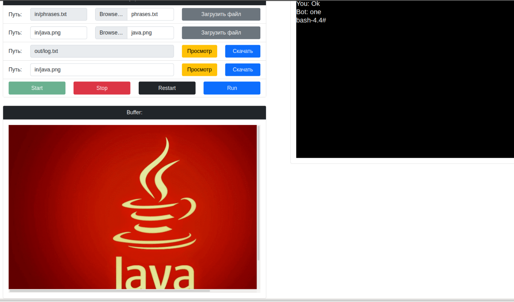

#### Purpose

Main goal of this project is providing opportunities of building and running console application written on different languages.

#### Functionality
1. Ability of administration languages, builders and configurations
2. Ability of building applications
3. Ability of running built application and interacting with it 

#### Used technologies

Backend technologies:
1. Java 14
2. Spring Data JPA, Spring Boot, Spring Security
3. JWT Authentication & Authorization
4. Docker 20.10
5. Docker Compose 3.9
6. RDBMS PostgreSQL 13

Frontend:
1. TypeScript 4.2.3
2. Angular 12
3. WebSocket for interacting with launched app
4. Bootstrap 5 for stylization

#### System architecture

| Service        |                             Appointment |
|----------------|-----------------------------------------|
| AdminService   | CRUD for languages, builders, configs   |
| AdminClient    | Admin panel for doing CRUD              |
| BuilderService | Service for building applications       |
| RunnerService  | Service for running applications        |
| RunnerClient   | Client for interacting with launched app|
| Site           | User projects management                |

#### Main models
- Programming language
- Project Builder
- Project Configuration
- Build
- App

#### System requirements
- Linux with preinstalled Docker
- Installed Maven and NPM for quickly running containers

#### Building and running

For running system it should make following steps:
1. Run script `build.sh`
2. Run Docker Compose `docker-compose up`

#### Main algorithm

Project works with Docker API using [Docker client](https://github.com/docker-java/docker-java). Before running application we need the following steps:

1. Create language, builder, configuration. Configuration contains Dockerfile script
2. Download project and unzip it
3. Build Docker image from source code and Dockerfile script from project config
4. Run app as Docker container
5. Attach to container using Websocket and interact with app I/O through it

#### UI

##### AdminClient

---

##### Runner Client

---

---

#### Contact me

See contacts [here](https://github.com/ShamRail).
